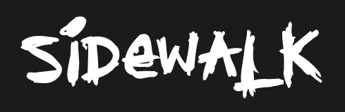

<br />

<h5 align="center" style="padding:0;margin:0;">Simon Riley</h5>
<h5 align="center" style="padding:0;margin:0;">170044</h5>
<h6 align="center">DV203 | Interaction Development</h6>
</br>
<p align="center">

  <a href="https://github.com/SimonR1ley/sidewalk">
    
  </a>

<h3 align="center">Sidewalk</h3>

  <p align="center">
    An eccomerce website built with React JS, Node Js and Mongo DB.<br>

   <br />
   <br />
   <a href="URL">View Demo</a>
    ·
    <a href="https://github.com/SimonR1ley/sidewalk/issues">Report Bug</a>
    ·
    <a href="https://github.com/SimonR1ley/sidewalk/issues">Request Feature</a>
</p>
<!-- TABLE OF CONTENTS -->

## Table of Contents

- [About the Project](#about-the-project)
    - [Project Description](#project-description)
    - [Built With](#built-with)
- [Getting Started](#getting-started)
    - [Prerequisites](#prerequisites)
    - [How to install](#how-to-install)
- [Features and Functionality](#features-and-functionality)
- [Concept Process](#concept-process)
    - [Ideation](#ideation)
    - [Wireframes](#wireframes)
- [Development Process](#development-process)
    - [Implementation Process](#implementation-process)
        - [Highlights](#highlights)
        - [Challenges](#challenges)
    - [Future Implementation](#peer-reviews)
- [Final Outcome](#final-outcome)
    - [Mockups](#mockups)
    - [Video Demonstration](#video-demonstration)
- [Conclusion](#conclusion)
- [License](#license)
- [Contact](#contact)
- [Acknowledgements](#acknowledgements)

<!--PROJECT DESCRIPTION-->

## About the Project

<!-- header image of project -->

![image1][image1]

### Project Description

Sidewalk! Sidewalk is an eccomerce website specializing in skateboard decks. 

### Built With
[&nbsp;&nbsp;&nbsp;&nbsp;&nbsp;&nbsp;&nbsp;&nbsp;](https://reactjs.org/)

[&nbsp;&nbsp;&nbsp;&nbsp;&nbsp;&nbsp;&nbsp;&nbsp;](https://nodejs.org/en/)

[&nbsp;&nbsp;&nbsp;&nbsp;&nbsp;&nbsp;&nbsp;&nbsp;](https://www.mongodb.com/cloud/atlas/lp/try2?utm_content=controlhterms&utm_source=google&utm_campaign=gs_emea_south_africa_search_core_brand_atlas_desktop&utm_term=mongo%20db&utm_medium=cpc_paid_search&utm_ad=e&utm_ad_campaign_id=12212624560&adgroup=115749711783&gclid=CjwKCAjwvNaYBhA3EiwACgndgpBlJl1i1pxu-5KG3cOiW2kU_xwBrb_u5se0jRQJm8RbqEc84EaSJhoC_7QQAvD_BwE)


<!-- GETTING STARTED -->
<!-- Make sure to add appropriate information about what prerequesite technologies the user would need and also the steps to install your project on their own mashines -->
## Getting Started

The following instructions will get you a copy of the project up and running on your local machine for development and testing purposes.

### Prerequisites

Ensure that you have the latest version of [NPM](https://www.npmjs.com/) installed on your machine. The [GitHub Desktop](https://desktop.github.com/) program will also be required.

### How to install

### Installation
Here are a couple of ways to clone this repo:

1. GitHub Desktop </br>
Enter `https://github.com/SimonR1ley/sidewalk.git` into the URL field and press the `Clone` button.

2. Clone Repository </br>
Run the following in the command-line to clone the project:
   ```sh
   git clone https://github.com/SimonR1ley/sidewalk.git
   ```
    Open `Software` and select `File | Open...` from the menu. Select cloned directory and press `Open` button

3. Install Dependencies </br>
Run the following in the command-line to install all the required dependencies:
   ```
   npm install axios
   <!-- npm install react-calendar -->
   npm install react-router-dom
   ```
## Features and Functionality

<!-- note how you can use your gitHub link. Just make a path to your assets folder -->

### Home Page Figma Design

![image2][image2]

### Management Page Figma Design

![image3][image3]

### Checkout Page Figma Design

![image4][image4]

### Login Page Figma Design
![image5][image5]

<!-- CONCEPT PROCESS -->
<!-- Briefly explain your concept ideation process -->
<!-- here you will add things like wireframing, data structure planning, anything that shows your process. You need to include images-->

## Concept Process

I started with the design in Figma, I found some inspiration images and combined all the ideas I like and formed my design. From there I started thinking about the functionality the website required and changed the designs around them. I then started the development.

### Wireframes

![image2][image2]
[image3][image3]
[image4][image4]
[image5][image5]


## Development Process

The `Development Process` is the technical implementations and functionality done for the app.

### Implementation Process

I used <b>React JS</b>, <b>Node JS</b> and <b>Mongo DB</b>.

#### React JS

- I started creating the designs I made in Figma.
- I started making all the nessecery components to link the website together.
- I connected all the components and added the functionality to the website.

#### Node JS

- I created my DB schemas.
- I connected them to my Routes using express and mongoose with the middleware.
- I went back to my components and called my data from the DB as well and linked the components used for pushing the data to the DB

#### Highlights

<!-- stipulated the highlight you experienced with the project -->

- A highlight of this project was definitely learning noSQL.
- I really do see the appeal and will be delving deeper into understanding and mastering more.

#### Challenges

<!-- stipulated the challenges you faced with the project and why you think you faced it or how you think you'll solve it (if not solved) -->

- I encountered quite a bit of challenges:
- I didn't get to add all the functionality I wanted, time got away from me and most of my time was occupied trying to fix bugs and issues for example, I wanted to loop through the indexes of my data call but my for loop wasn't working the the useEffect by the Axios call. I did some research and ended up using a for each loop which helped solve the issue.

### Future Implementation

<!-- TODO Change this! -->

<!-- stipulate functionality and improvements that can be implemented in the future. -->

- I would like to add the images to the website
- I want to fix the orders page where I can remove and update the stock.
- I want to fix my product cards and make them look better and more professional

<!-- MOCKUPS -->

## Final Outcome

### Mockups

<!-- TODO Change this -->

![image10][image10]
![image11][image11]
![image12][image12]
![image13][image13]
<br>

See the [open issues](https://github.com/SimonR1ley/sidewalk/issues) for a list of proposed features (and known issues).

<!-- AUTHORS -->

## Authors

- **Simon Riley** - [Github](https://github.com/SimonR1ley)

<!-- LICENSE -->

## License

Distributed under the MIT License. See `LICENSE` for more information.\

<!-- LICENSE -->

## Contact

- **Simon Riley** - [170044@virtualwindow.co.za]](mailto:170044@virtualwindow.co.za)
- **Project Link** - https://github.com/SimonR1ley/sidewalk

<!-- ACKNOWLEDGEMENTS -->

## Acknowledgements

<!-- all resources that you used and Acknowledgements here -->
<!-- TODO Change this -->

- [Figma](https://www.figma.com/)
<!-- - [Zlatko Plamenov Mockups](https://www.freepik.com/author/zlatko-plamenov) -->

[image1]: Images/mockup1.png
[image2]: Images/home_page.png
[image3]: Images/management_page.png
[image4]: Images/checkout_page.png
[image5]: Images/login_page.png
<!-- [image6]: Images/highscore.jpg -->
<!-- [image7]: Images/wireframes.png -->
<!-- [image8]: Images/moodboard.png -->
<!-- [image9]: Images/userflow.png -->
[image10]: Images/mockup1.png
[image11]: Images/mockup2.png
[image12]: Images/mockup3.png
[image13]: Images/mockup4.png
